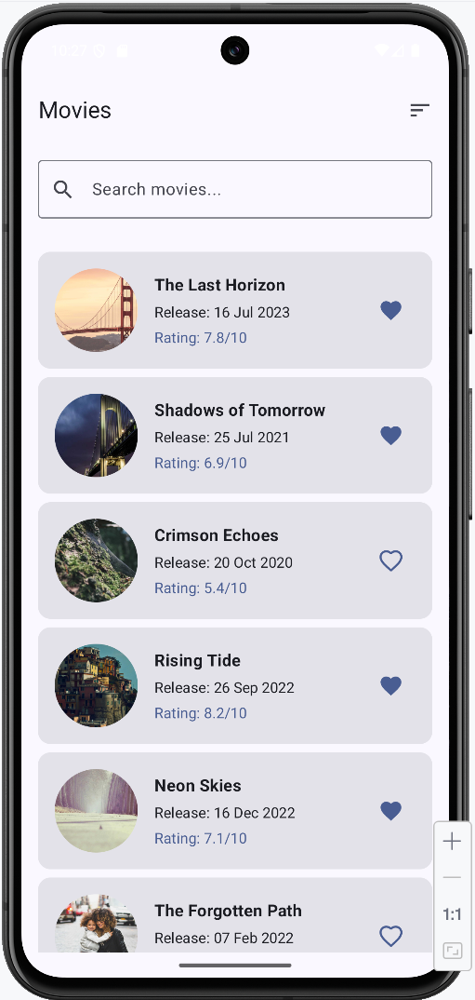
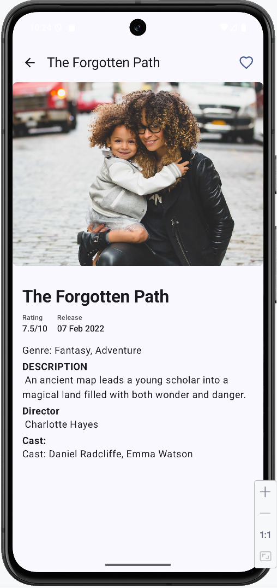
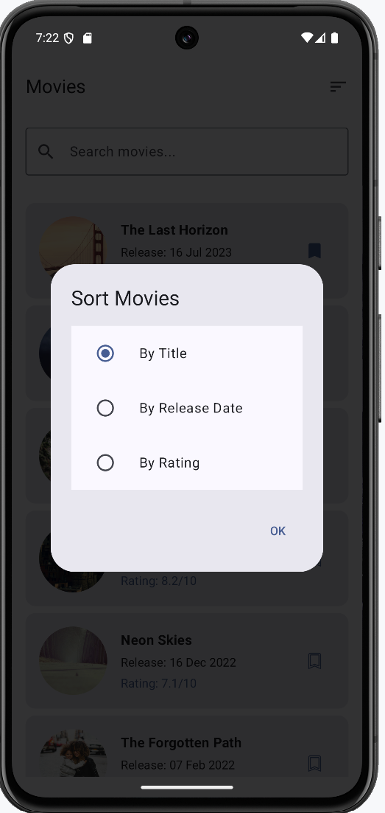

# 🚀 App Name

  

## 📱 About
A modern Android app for movie lovers to discover, search, and save their favorite films.

## ✨ Features
Browse Movies - Beautiful list with posters, titles, and ratings

Smart Search - Find movies by title instantly

Sort & Filter - Organize by title, date, or rating

Bookmark Favorites - Save movies for offline viewing

Detailed Views - Complete movie information

## 🛠 Tech Stack
- **Kotlin** - Programming language
- **Jetpack Compose** - Modern UI toolkit
- **Room** - Local database
- **Retrofit** - HTTP client
- **Dagger-Hilt** - Dependency injection

## 📸 Screenshots
| Home Screen                                  | Details Screen                              | Filter                                                    |
|----------------------------------------------|---------------------------------------------|-----------------------------------------------------------|
|   |  |  |

## 🏗 Project Structur
MovieApp/
├── app/
├── build.gradle.kts
├── settings.gradle.kts
├── core/
├── data/
├── domain/
├── features/
│   ├── movie/
│   └── bookmark/
└── README.md